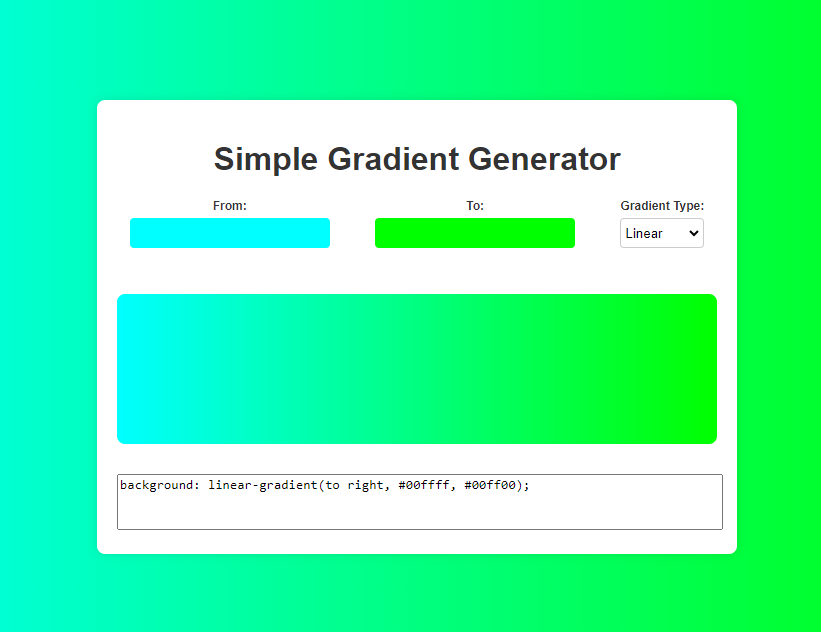

# Simple Gradient  Generator
This is a generator for simple css gradients. You can use find it directly from [https://tiberiupetcu.github.io/simple-gradient-generator/](https://tiberiupetcu.github.io/simple-gradient-generator/).

  ## Usage
  Just click on the "From" and "To" colors to select the gradient. The "Gradient Type" select will allow to configure some predefined types of gradients.  
  If you click inside the textarea where the code of the gradient is output, then it will automatically get copied to clipboard.
  
  